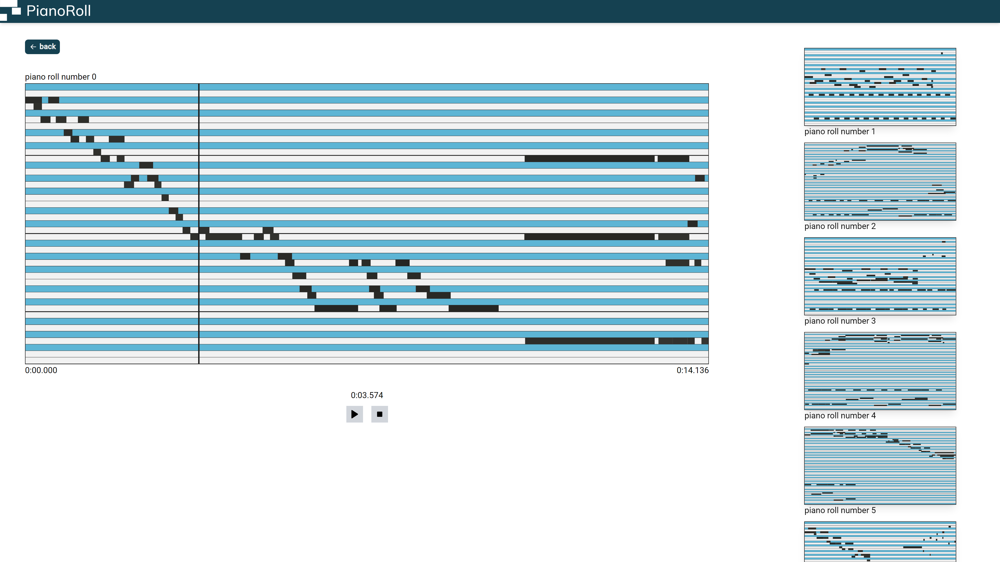

# Piano roll

This is solution to pianoroll.io [challenge](https://github.com/Nospoko/pianoroll-frontend-challenge#main-view).

You can access the live deployment of this project [here](https://rafalbodanka.github.io/pianoroll/).

## Table of Contents

- [Installation](#installation)
- [Usage](#usage)
- [Credits](#credits)

## Installation

1. Open a new terminal and navigate to the root folder.
2. Install the required dependencies by running the following command:

   ```bash
   npm install
   ```

3. Start the development server by running the following command:

   ```bash
   npm start
   ```

You should be able to access the app in your web browser at http://localhost:3000.

## Usage

The Pianoroll project retrieves random data from pianoroll.ai using the `useFetchRolls` function. It then displays 20 results on the main page in the form of a dynamic grid. During the data retrieval process, a placeholder view known as "skeleton rolls" is displayed.

### Main Page
- The main page displays 20 random rolls in a dynamic grid.
- Users can select one of the displayed rolls.


### Roll View
- When a roll is selected, the view switches to a player view with the chosen roll.
- A list of the remaining 19 results is displayed alongside or below the player.


### User Interaction
- Users can switch between different rolls in the player view.
- Users can return to the main page displaying all rolls.
- On mobile devices, switching between rolls in the player view scrolls the screen to the top.

### Player
- The player consists of the `Player` component and the `MainPianoRoll`.
- It displays the start and end times of the selected roll.
- An "Indicator" is added to track the current playback position.
- Playback control buttons, including play/pause and stop, are provided.
- Clicking the stop button resets the Indicator to the beginning of the roll or the selected range.



### Selection
- Users can dynamically select a portion of the roll using the Indicator.
- The selected range can be played again using control buttons (PlayerOptions).
- Clicking outside the selection clears it, while clicking inside it doesn't remove the selection but moves the Indicator to the selected position.
- The selection can also be removed using a button in the selection menu next to the start-end time information.


### Interaction with the Rolls
- Clicking on a roll sets the Indicator to the chosen position.
- Clicking and dragging (or using touch on mobile devices) sets a range.

### Display
- Above the playback control buttons, the current player time is displayed.
- The "Selected Range" dynamically shows the selected time range and the number of included tiles.
- Selected tiles are also logged using `console.log` after the selection process.

### Refresh and Navigation
- The sound list can be regenerated by refreshing the page or clicking on the logo in the Navbar, which leads to the main page (/pianoroll).

## Credits

This project utilizes most of all the following libraries, frameworks, and resources:

- [React](https://reactjs.org/): A JavaScript library for building user interfaces.
- [Tailwind CSS](https://tailwindcss.com/): A utility-first CSS framework for rapidly building custom user interfaces.
- [Pianoroll.ai API](https://pianoroll.ai/random_notes): A collection of random notes.

Please refer to the documentation or official websites of these resources for more information on how they were used in this project.
